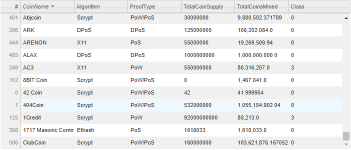

# Cryptocurrencies
Module 18

## Overview

An investment bank would like to create a cryptocurrency investment portfolio.  This analysis and report identifed the currencies that are currently trading and classified them.  This project used pre-processing with Pandas and Python to clean a cryptocurrency dataset.  Unsupervised machine learning was used to cluster the data, then tables and visualizations were produced to visualize the dataset.

## Process

The supplied data file was read in as a DataFrame and columns were evaluated.  The bank was interested in only the cryptocurrencies that are currently available for trade, so the data was filtered to remove the rows where IsTrading was false. That column was then dropped from the DataFrame and rows containing null values were removed. 

<figcaption align = "center"><b>Sample of Filtered Data</b></figcaption> 

The data was then further filtered to include only Coins that had a mined value of greater than zero so that there is a supply that is available for trade.

<figcaption align = "center"><b>Coins with available supply</b></figcaption> 

The coin names were pulled to a separate DataFrame and the column was dropped from the working DataFrame since it was not needed for use in the data clustering. The get_dummies function was used to create variables for the two categorical columns and the data was scaled using a StandardScaler.  Principal Component Analysis (PCA) was used to identify three principal components. An elbow curve was plotted to determine cluster number.  

<figcaption align = "center"><b>Elbow Curve</b></figcaption> 

Four clusters were used to fit the model and perform predictions of the classes which were added to a DataFrame. The previous DataFrames were joined to encompass all data.

<figcaption align = "center"><b>Clustered DataFrame</b></figcaption> 

A 3D-scatter plot depicting the PCA data and clusters was plotted. The hover text shows the Coin name, PCA data, Algorithm and Class for each point. 

<figcaption align = "center"><b>3-D Scatter Plot</b></figcaption>

A sortable, selectable table was created from the tradable cryptocurrencies with hvplot and the total available for trade was calculated.

<figcaption align = "center"><b>Tradable Cryptocurrencies Table</b></figcaption>

<figcaption align = "center"><b></b></figcaption>

The total coin supply and coins mined were pulled and scaled using a MinMaxScaler with a set range of values 0-1.  The scaled values were added to a DataFrame and CoinName and Class were pulled from the clustered_df. A scatter plot was made using hvplot for the visualization.

<figcaption align = "center"><b>Coin Data</b></figcaption>

<figcaption align = "center"><b>Coin Scatter Plot</b></figcaption>

#### Resources
crypto_data.csv from https://min-api.cryptocompare.com/data/all/coinlist was used in this analysis.
